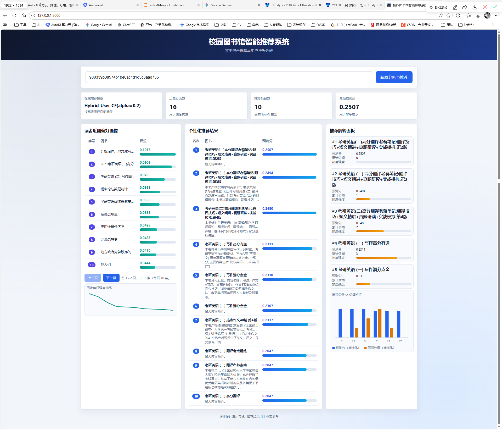

# 基于混合推荐与精排模型的高校图书借阅推荐研究

## 📖 项目简介
本项目基于真实高校图书馆借阅日志，构建了一套端到端的数据分析与智能推荐系统。项目涵盖数据清洗、探索性数据分析 (EDA)、引入时间衰减因子的特征工程、以及基于隐式反馈的混合协同过滤推荐模型构建，并最终实现了基于 Flask 的 Web 展示。

---

## 💻 技术栈
* **核心编程语言**：Python 3.9+
* **数据处理与科学计算**：Pandas, NumPy, SciPy
* **机器学习与核心算法**：Scikit-learn (TF-IDF, TruncatedSVD)、LightGBM
* **探索性数据分析 (EDA)**：Matplotlib, Seaborn
* **Web 后端与服务接口**：Flask, Jinja2
* **前端基础技术**：HTML5, CSS3

---

## 📁 项目结构
```text
Campus Library Borrowing Data Analysis And Recommendation/
├── data/
│   ├── features/                          (特征工程产出：模型输入与评估结果)
│   │   ├── book_tfidf_matrix.npz          (图书 TF-IDF 稀疏矩阵)
│   │   ├── books_info.pkl                 (图书元数据映射表)
│   │   ├── user_item_weights.pkl          (含时间衰减的用户-物品交互矩阵)
│   │   ├── model_comparison_results.csv   (模型对比结果)
│   │   ├── hybrid_weight_grid_results.csv (Hybrid 权重网格结果)
│   │   ├── svd_component_tuning_results.csv (SVD 维度寻参结果)
│   │   └── ml_ranker_train_candidates.csv (精排训练样本)
│   ├── processed/
│   │   ├── images/                        (EDA 图表集合)
│   │   └── LENDHIST2019_2020_cleaned.csv  (清洗后的高质量全量数据)
│   └── raw/
│       ├── LENDHIST2019_2020_gb18030.csv  (原始数据)
│       └── LENDHIST2019_2020_utf8.csv     (UTF-8 转码数据)
├── models/                                (预留：后续模型文件)
├── src/
│   ├── templates/
│   │   └── index.html
│   ├── app.py
│   ├── data_cleaning.ipynb
│   ├── eda_visualizer.ipynb
│   ├── feature_engineering.ipynb
│   ├── recommender_models.ipynb
│   └── sample.ipynb
├── README.md
└── requirements.txt
```

---

## 📊 数据集说明
**东北财经大学图书馆用户借阅记录数据集**
* **数据来源**：https://www.libraryjournal.com.cn/CN/Y2022/V41/I10/104
* **时间范围**：本项目选取了 **2017–2020 年**期间的借阅数据进行建模与评估。
* **数据规模**：按当前数据清洗结果，包含 **99,254 条有效借阅记录**，涉及 **10,676 名用户** 与 **52,745 本图书**（按 `BOOK_ID` 去重）。
* **数据特征**：涵盖用户维度（USERID, SEX, DEPT, OCCUPATION 等）与图书维度（BOOK_ID, CALL_NO, TITLE, ABSTRACT, SUB 等）。

---

## 🛠️ 数据预处理 (Data Cleaning)
真实系统导出的数据存在空缺、异常与格式不一致问题，清洗策略如下：
1. **缺失值处理**：用户画像字段缺失填充 `'Unknown'`；文本字段缺失填充空字符串。
2. **时间格式修复**：修复异常时间串（如 `2020-01-1321:23:17`），统一转为 `datetime`。
3. **逻辑异常处理（更新）**：
   - 剔除 `LEND_DATE` 无效记录。
   - 对于 `IS_RETURNED=1 且 LEND_DAYS < 0`：判定为异常记录。
   - 对于 `IS_RETURNED=1 且 LEND_DAYS = 0`：不直接删除，修正为“未归还”：
     - `RET_DATE = NaT`
     - `IS_RETURNED = 0`
     - `LEND_DAYS = NaN`
4. **重复行为去重**：按 `USERID + BOOK_ID + LEND_DATE` 去重。
5. **特征衍生**：生成 `IS_RETURNED`、`LEND_DAYS`、`LEND_MONTH`、`LEND_HOUR`、`LEND_DAYOFWEEK`。

---

## 📈 探索性数据分析 (EDA)
通过多维度可视化挖掘读者行为模式：
* **时序规律**：存在明显学期周期性与日内借阅高峰。
* **用户与学科画像**：识别主要借阅人群与热门学科类别。
* **交叉分析**：输出学科-时段热力图、借阅趋势图，为后续建模提供依据。

---

## ⚙️ 特征工程 (Feature Engineering)
针对隐式反馈（Implicit Feedback）设计：
1. **图书内容向量化**：基于 `TITLE + SUB` 的 TF-IDF 稀疏向量。
2. **时间衰减兴趣权重**：按借阅行为时间衰减加权。
3. **用户-物品交互矩阵构建**：聚合并归一化得到模型输入。

---

## 🧠 核心推荐模型 (Model Overview)
在原有 Content-Based + SVD-CF 混合框架基础上，当前实验扩展为：
1. `Popularity`
2. `Content-Based`
3. `User-CF`
4. `Item-CF`
5. `SVD-CF`
6. `BPR-MF`
7. `Hybrid-SVD-CF(alpha=*)`
8. `Hybrid-User-CF(alpha=*)`
9. `Hybrid-BPR-MF(alpha=*)`
10. `ML-Ranker (LightGBM-Ranker)`

说明：
* 评估用户规模：`300`
* Top-K：`K=10`
* SVD 维度支持寻参（结果见 `svd_component_tuning_results.csv`）
* 最终评估中 SVD 可固定维度（当前设置为 100）

---

## 🧪 最新离线评估结果（Top-10）
来源：`data/features/model_comparison_results.csv`

| 模型 | Precision@10 | Recall@10 | F1@10 | HitRate@10 | NDCG@10 |
| :--- | ---: | ---: | ---: | ---: | ---: |
| Popularity | 0.004333 | 0.012472 | 0.005934 | 0.036667 | 0.008448 |
| User-CF | 0.012667 | 0.042664 | 0.016887 | 0.103333 | 0.030490 |
| Item-CF | 0.002667 | 0.015611 | 0.004252 | 0.026667 | 0.010727 |
| SVD-CF | 0.003333 | 0.011916 | 0.004521 | 0.030000 | 0.009431 |
| BPR-MF | 0.004000 | 0.011361 | 0.005421 | 0.033333 | 0.008358 |
| Content-Based | 0.008667 | 0.031963 | 0.012587 | 0.073333 | 0.023881 |
| Hybrid-SVD-CF(alpha=0.4) | 0.009667 | 0.045911 | 0.014571 | 0.083333 | 0.028886 |
| **Hybrid-User-CF(alpha=0.2)** | **0.014667** | **0.054335** | **0.020672** | **0.123333** | **0.043424** |
| Hybrid-BPR-MF(alpha=0.9) | 0.010667 | 0.044324 | 0.015765 | 0.093333 | 0.032105 |
| LightGBM-Ranker | 0.004333 | 0.029120 | 0.007058 | 0.043333 | 0.018724 |

当前最佳模型（按 F1@10）：`Hybrid-User-CF(alpha=0.2)`。

---

## 🌐 Web 展示
> 

系统提供读者检索、偏好画像展示与推荐列表输出，用于演示离线模型在在线场景中的应用效果。

---

## 🚀 快速启动
1. 安装依赖：
   ```bash
   pip install -r requirements.txt
   ```
2. 运行服务：
   ```bash
   cd src
   python app.py
   ```
3. 浏览器访问：
   `http://127.0.0.1:5000`
