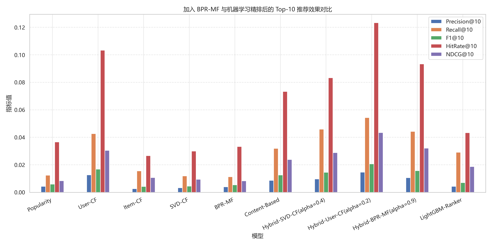
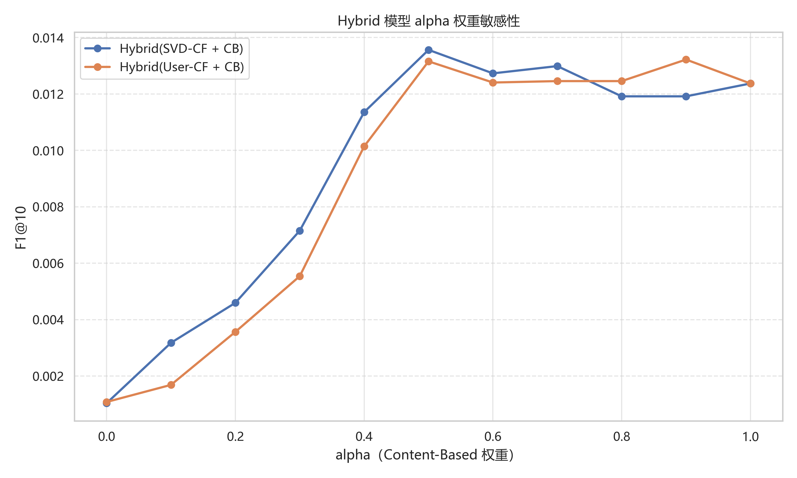
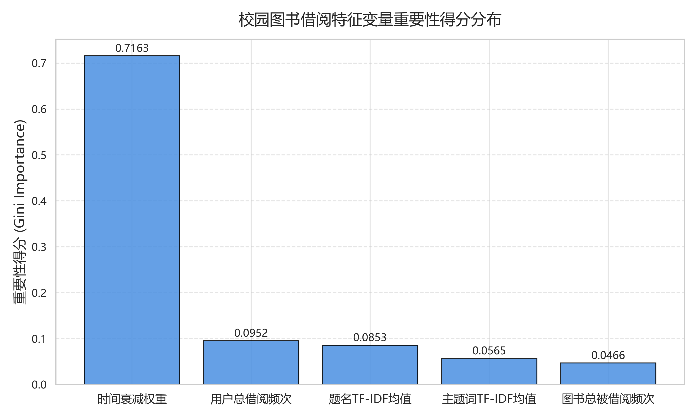

# 基于混合推荐与精排模型的高校图书借阅推荐研究

洪衍松^1^

（1. 华北电力大学 计算机系，河北 保定 071003）

---

**摘　要**：为缓解高校图书馆传统借阅服务中个性化推荐不足、热门图书偏置明显以及读者兴趣时效性刻画不足等问题，本文基于真实高校图书馆借阅日志构建了一套端到端图书推荐系统。系统首先对 2017-2020 年借阅数据进行编码转换、标准化建表、缺失值处理、时间格式修复、借阅时长异常处理与重复行为去重；随后基于图书题名与主题词构建 TF-IDF 内容向量，并融合用户内时间衰减、图书热度、用户活跃度等因素形成隐式反馈兴趣权重；在模型层面实现 Popularity、Content-Based、User-CF、Item-CF、SVD-CF、BPR-MF、混合推荐模型以及 LightGBM 二阶段精排模型。实验采用按时间留后验证策略，在 300 名评估用户上进行 Top-10 推荐效果比较。结果表明，Hybrid-User-CF(alpha=0.2) 在 Precision@10、Recall@10、F1@10、HitRate@10 和 NDCG@10 上分别达到 0.014667、0.054335、0.020672、0.123333 和 0.043424，综合表现优于单一内容推荐、单一协同过滤与其他混合模型。最后，本文基于 Flask 实现在线演示系统，支持读者检索、历史偏好分页展示、推荐列表输出与推荐解释。研究表明，内容特征与用户协同信号的适度融合能够有效提升高校图书借阅推荐的命中能力与可解释性。

**关 键 词**：高校图书馆；图书推荐；混合推荐；协同过滤；隐式反馈；LightGBM 精排

**中图分类号**：G250.7；TP391　　　　**文献标识码**：A　　　　**DOI**：

---

# Research on Campus Library Borrowing Recommendation Based on Hybrid Recommendation and Re-ranking Models

HONG Yansong^1^

(1. Department of Computer Science, North China Electric Power University, Baoding Hebei 071003, China)

**Abstract**: To address the insufficient personalization, popularity bias, and weak temporal interest modeling in traditional campus library borrowing services, this paper builds an end-to-end book recommendation system based on real library borrowing logs. The system first performs encoding conversion, standardized table construction, missing-value processing, datetime repair, abnormal lending-duration correction, and duplicate-event removal on borrowing data from 2017 to 2020. Then, TF-IDF vectors are constructed from book titles and subject terms, and implicit feedback weights are generated by integrating user-level time decay, book popularity, and user activity. At the model level, Popularity, Content-Based, User-CF, Item-CF, SVD-CF, BPR-MF, hybrid recommenders, and a LightGBM-based two-stage re-ranking model are implemented. A chronological holdout evaluation is conducted on 300 users under the Top-10 recommendation setting. Experimental results show that Hybrid-User-CF(alpha=0.2) achieves Precision@10, Recall@10, F1@10, HitRate@10, and NDCG@10 of 0.014667, 0.054335, 0.020672, 0.123333, and 0.043424, respectively, outperforming single content-based, single collaborative filtering, and other hybrid models. Finally, a Flask-based web demonstration system is implemented for reader search, paginated borrowing history, recommendation output, and recommendation interpretation. The results indicate that properly combining content features with user collaborative signals can improve both recommendation effectiveness and interpretability in campus library borrowing scenarios.

**Keyword**: Campus Library; Book Recommendation; Hybrid Recommendation; Collaborative Filtering; Implicit Feedback; LightGBM Re-ranking

---

## 0 引言

高校图书馆是教学科研资源服务的重要入口。随着馆藏资源规模扩大，读者面对的图书选择空间快速增加，传统依赖人工检索、分类导航和热门榜单的服务方式难以充分匹配读者的长期兴趣、近期需求与学科背景。推荐系统能够根据历史行为和资源内容自动筛选候选图书，在数字图书馆、电子商务和内容平台中已得到广泛应用。

图书借阅数据具有典型的隐式反馈特征：读者借阅一本书通常表示一定程度的兴趣，但未借阅不等价于不感兴趣；同时，借阅行为还受到课程安排、学期周期、馆藏副本、热门教材等因素影响。若仅采用热门推荐，容易造成头部图书过度曝光；若仅采用内容推荐，则难以捕捉相似读者之间的行为共性；若仅采用协同过滤，又容易受到稀疏性与冷启动问题影响。因此，将内容特征、协同信号和时间因素结合，是高校图书推荐任务中较为稳健的方案。

本文围绕真实高校图书馆借阅日志开展研究，主要工作包括：

1. 构建从原始借阅日志到标准用户表、图书表和借阅事实表的数据处理流程；
2. 设计结合时间衰减、图书内容、图书热度和用户活跃度的隐式反馈权重；
3. 实现并比较多类 Top-K 推荐模型，包括内容推荐、协同过滤、矩阵分解、BPR-MF、混合模型和 LightGBM 精排；
4. 基于 Flask 构建可交互的图书推荐展示系统，验证离线模型在在线服务场景中的可用性。

## 1 数据来源与预处理

### 1.1 数据来源

实验数据来自高校图书馆用户借阅记录。项目中使用的数据文件包括 `LENDHIST2017_2018_gb18030.csv`、`LENDHIST2019_2020_utf8.csv` 等原始借阅日志，并通过数据准备流程生成 2017-2020 年标准化数据表。经合并处理后，标准三表规模如表 1 所示。

**表 1　2017-2020 年标准数据表规模**

| 数据表 | 文件路径 | 规模 | 说明 |
|---|---:|---:|---|
| 用户表 | `data/processed/users_2017_2020.csv` | 19,706 × 7 | 保留每名读者的最新用户画像信息 |
| 图书表 | `data/processed/books_2017_2020.csv` | 110,931 × 11 | 按 `BOOK_ID` 形成图书元数据 |
| 借阅事实表 | `data/processed/borrows_2017_2020.csv` | 304,293 × 7 | 保留完整借阅事件 |

此外，项目对 2019-2020 年数据进行了更细粒度清洗，得到 `LENDHIST2019_2020_cleaned.csv`，包含 99,254 条有效借阅记录、10,676 名用户和 52,745 本图书。

### 1.2 数据标准化

原始数据存在编码不一致、日期时间格式异常、空值和字符串型 `nan` 等问题。本文首先将 2017-2018 年 `gb18030` 编码数据转换为 `utf-8-sig`，再与 2019-2020 年数据合并。对于形如 `2019-11-2909:46:42` 的时间字符串，采用正则方式补齐日期与时间之间的空格，并统一转换为 `datetime` 类型。

标准化后，按最新借阅时间保留用户和图书维度信息，分别生成用户信息表、图书信息表和借阅事实表。该三表结构既便于探索性分析，也便于在后续特征工程中进行用户、图书和借阅行为的关联。

### 1.3 数据清洗

本文采用如下清洗规则：

1. 对 `SEX`、`DEPT`、`OCCUPATION` 等用户字段缺失值填充 `Unknown`；
2. 对 `ABSTRACT`、`SUB`、`CALL_NO`、`AUTHOR`、`PUBLISHER` 等图书文本字段缺失值填充空字符串；
3. 根据 `RET_DATE` 是否为空生成 `IS_RETURNED` 字段；
4. 根据 `RET_DATE-LEND_DATE` 计算 `LEND_DAYS`，并派生 `LEND_MONTH`、`LEND_HOUR`、`LEND_DAYOFWEEK`；
5. 删除 `LEND_DATE` 无法解析的记录；
6. 对 `IS_RETURNED=1` 且 `LEND_DAYS=0` 的记录修正为未归还状态；
7. 删除已归还但 `LEND_DAYS<0` 的逻辑异常记录；
8. 按 `USERID+BOOK_ID+LEND_DATE` 去除重复借阅事件。

## 2 探索性数据分析

为理解借阅行为规律，本文从用户、图书、时间和共现关系四个角度进行探索性数据分析。可视化结果保存在 `data/processed/images/` 目录。

用户层面，统计学院借阅活跃度 Top10 与读者类型比例，用于观察主要借阅人群构成。图书层面，统计热门图书 Top10 和中图法大类分布，用于识别高频资源与学科偏好。时间层面，按月份、星期和小时统计借阅行为，观察学期周期与日内高峰。关联层面，按同一用户同日借阅书目构造共现组合，挖掘常被共同借阅的图书关系。

图 1 展示了最终系统界面。界面包含读者检索、历史偏好画像、推荐结果列表和推荐解释面板，用于将离线推荐结果转化为可交互展示。

## 3 特征工程

### 3.1 图书内容向量

图书内容特征由题名 `TITLE` 与主题词 `SUB` 拼接得到，使用 TF-IDF 进行向量化：

\[
x_i = TFIDF(TITLE_i + SUB_i)
\]

其中 \(x_i\) 表示第 \(i\) 本图书的内容向量。项目中设置 `max_features=5000`，生成稀疏矩阵 `book_tfidf_matrix.npz`。该矩阵用于内容推荐和混合推荐中的内容相似度计算。

### 3.2 时间衰减兴趣权重

图书借阅兴趣具有时间变化特征。本文以每名用户自己的最近借阅时间作为基准，计算每条借阅记录距离该用户最近行为的天数：

\[
days\_ago_{ui}=base\_date_u-lend\_date_{ui}
\]

并采用指数衰减函数表示时间影响：

\[
time\_decay_{ui}=\exp(-\lambda \cdot days\_ago_{ui}),\quad \lambda=\frac{\ln 2}{180}
\]

该设置表示兴趣权重半衰期约为 180 天，能够弱化过早历史行为对当前推荐的影响。

### 3.3 综合隐式反馈权重

为避免时间因素过强导致近期行为过拟合，本文采用“弱化时间”的综合权重方案。综合兴趣权重由时间衰减、题名 TF-IDF 均值、主题词 TF-IDF 均值、图书总被借阅频次和用户总借阅频次加权得到：

\[
w_{ui}=0.15f_1+0.30f_2+0.25f_3+0.20f_4+0.10f_5
\]

其中 \(f_1\) 为时间衰减权重，\(f_2\) 为题名 TF-IDF 均值，\(f_3\) 为主题词 TF-IDF 均值，\(f_4\) 为图书总被借阅频次，\(f_5\) 为用户总借阅频次。各特征在加权前均进行 Min-Max 归一化。最终按 `USERID` 与 `BOOK_ID` 聚合得到用户-图书交互权重矩阵。

**表 2　综合兴趣权重特征配置**

| 特征 | 权重 | 含义 |
|---|---:|---|
| 时间衰减权重 | 0.15 | 刻画用户近期兴趣 |
| 题名 TF-IDF 均值 | 0.30 | 刻画图书题名内容信息 |
| 主题词 TF-IDF 均值 | 0.25 | 刻画图书主题语义信息 |
| 图书总被借阅频次 | 0.20 | 刻画图书全局热度 |
| 用户总借阅频次 | 0.10 | 刻画用户活跃程度 |

## 4 推荐模型设计

### 4.1 基线模型

本文首先构建热门推荐、内容推荐和协同过滤基线。热门推荐根据训练集中图书累计交互权重排序；内容推荐根据用户历史高权重图书构造用户画像，并计算其与候选图书 TF-IDF 向量的余弦相似度；User-CF 计算目标用户与其他用户在交互矩阵上的相似度，并聚合相似用户的图书偏好；Item-CF 根据用户历史图书与候选图书之间的相似度生成推荐分数。

### 4.2 矩阵分解模型

SVD-CF 使用 `TruncatedSVD` 对用户-图书隐式反馈矩阵进行降维分解：

\[
R \approx U\Sigma V^T
\]

其中 \(R\) 为用户-图书交互矩阵，\(U\) 表示用户隐因子，\(V\) 表示图书隐因子。预测阶段通过用户隐向量与图书隐向量点积获得候选图书分数。

BPR-MF 面向隐式反馈 Top-K 推荐任务，采用成对排序思想。对于用户 \(u\)、正样本图书 \(i\) 和负样本图书 \(j\)，优化目标为：

\[
\max \sum_{(u,i,j)} \ln \sigma(\hat{x}_{ui}-\hat{x}_{uj})-\lambda ||\Theta||^2
\]

该目标直接鼓励用户已交互图书的预测分数高于未交互图书。

### 4.3 混合推荐模型

混合模型将内容分数与协同分数线性融合：

\[
score=\alpha \cdot score_{CB}+(1-\alpha)\cdot score_{CF}
\]

本文分别构造 `Hybrid-SVD-CF`、`Hybrid-User-CF` 和 `Hybrid-BPR-MF`，并在 \(\alpha \in [0,1]\) 上进行网格搜索。该设计用于比较内容信号与不同协同信号的组合效果。

### 4.4 二阶段精排模型

为进一步提升候选排序质量，本文基于 LightGBM 构建二阶段精排模型。第一阶段由热门推荐、内容推荐、协同过滤、矩阵分解与混合模型产生候选集合；第二阶段以候选图书的多路召回分数、用户历史规模等特征作为输入，使用 `LGBMRanker` 进行排序学习。训练时采用用户级折外预测，避免同一用户同时出现在精排训练与评估预测中造成信息泄漏。

## 5 实验设计与结果分析

### 5.1 实验设置

实验采用时间留后验证。对活跃用户按借阅时间排序，将每名评估用户最后 20% 的唯一书名作为测试集，其余作为训练历史；非评估用户完整历史作为协同过滤背景。评估用户规模为 300，推荐列表长度 \(K=10\)。评价指标包括 Precision@10、Recall@10、F1@10、HitRate@10 和 NDCG@10。

### 5.2 模型对比结果

**表 3　不同推荐模型 Top-10 离线评估结果**

| 模型 | Precision@10 | Recall@10 | F1@10 | HitRate@10 | NDCG@10 |
|---|---:|---:|---:|---:|---:|
| Popularity | 0.004333 | 0.012472 | 0.005934 | 0.036667 | 0.008448 |
| User-CF | 0.012667 | 0.042664 | 0.016887 | 0.103333 | 0.030490 |
| Item-CF | 0.002667 | 0.015611 | 0.004252 | 0.026667 | 0.010727 |
| SVD-CF | 0.003333 | 0.011916 | 0.004521 | 0.030000 | 0.009431 |
| BPR-MF | 0.004000 | 0.011361 | 0.005421 | 0.033333 | 0.008358 |
| Content-Based | 0.008667 | 0.031963 | 0.012587 | 0.073333 | 0.023881 |
| Hybrid-SVD-CF(alpha=0.4) | 0.009667 | 0.045911 | 0.014571 | 0.083333 | 0.028886 |
| **Hybrid-User-CF(alpha=0.2)** | **0.014667** | **0.054335** | **0.020672** | **0.123333** | **0.043424** |
| Hybrid-BPR-MF(alpha=0.9) | 0.010667 | 0.044324 | 0.015765 | 0.093333 | 0.032105 |
| LightGBM-Ranker | 0.004333 | 0.029120 | 0.007058 | 0.043333 | 0.018724 |

从表 3 和图 2 可以看出，单一 Popularity 模型效果较弱，说明仅依赖全局热门图书难以满足个性化推荐需求。Content-Based 模型优于 Popularity，表明图书题名与主题词能够提供有效内容信号。User-CF 在单一模型中表现最好，说明高校图书借阅行为中存在较明显的相似读者偏好结构。

混合模型整体优于对应单模型，其中 `Hybrid-User-CF(alpha=0.2)` 获得最优 F1@10 和 NDCG@10。这说明在当前数据集上，用户协同信号应占主导，内容特征作为辅助能够缓解协同过滤的稀疏性问题。`LightGBM-Ranker` 未超过最优混合模型，可能原因是候选集合规模有限、正样本较少，以及当前精排特征仍以多路召回分数为主，缺少更丰富的上下文特征。

### 5.3 混合权重敏感性

图 3 展示了不同 \(\alpha\) 配置下混合模型的 F1@10 变化。`Hybrid-User-CF` 在 \(\alpha=0.2\) 时达到最佳，表示内容分数占 20%、User-CF 分数占 80% 时综合效果最好。`Hybrid-SVD-CF` 与 `Hybrid-BPR-MF` 的最优权重分别为 0.4 和 0.9，说明不同协同模型对内容信号的依赖程度存在差异。

### 5.4 特征重要性分析

图 4 为辅助随机森林得到的特征重要性结果。该分析用于验证综合兴趣权重中不同特征对兴趣标签构造的相对贡献。结果显示，图书内容相关特征与时间衰减特征对兴趣权重构造具有较强影响，说明在高校图书推荐中同时考虑内容语义和时间因素是必要的。

## 6 系统实现

### 6.1 系统架构

在线系统采用 Flask 实现，核心代码位于 `src/app.py`。启动时系统加载 `book_tfidf_matrix.npz`、`books_info.pkl` 和 `user_item_weights.pkl`，并基于用户-图书交互矩阵在线构建 SVD 因子。系统读取 `model_comparison_results.csv` 中的离线评估结果，自动选择 F1@10 最优模型作为推荐配置。若离线最优模型无法在当前 Web 服务中完整在线推断，则回退至已实现的可用混合模型。

### 6.2 功能实现

系统前端模板位于 `src/templates/index.html`，主要功能包括：

1. 输入读者 `USERID` 并提交检索；
2. 展示该读者历史借阅偏好及兴趣权重；
3. 输出 Top-10 个性化推荐图书；
4. 展示预测分数、累计借阅热度与简要推荐解释；
5. 通过 `/history_page` 接口实现历史借阅分页加载。

该系统将离线推荐模型封装为可交互服务，便于观察不同读者的历史行为与推荐结果之间的关系。

## 7 结论

本文基于高校图书馆真实借阅日志，完成了数据预处理、探索性分析、特征工程、推荐模型训练、离线评估和 Web 展示的完整流程。实验结果表明，相比热门推荐、内容推荐、矩阵分解和 BPR-MF 等单一模型，融合内容信号与用户协同信号的混合推荐模型取得更优效果。其中 `Hybrid-User-CF(alpha=0.2)` 在 Top-10 设置下达到最佳 F1@10=0.020672 和 NDCG@10=0.043424，说明适度引入内容特征能够提升用户协同过滤在稀疏借阅数据上的推荐质量。

后续研究可从三个方向改进：第一，引入更丰富的图书语义表示，如预训练语言模型向量；第二，增加借阅上下文特征，如学院、专业、课程周期和借阅地点；第三，优化精排阶段的候选生成与标签构造，提高 LightGBM 精排模型对个性化偏好的学习能力。

## 参考文献

[1] Ricci F, Rokach L, Shapira B. Recommender Systems Handbook[M]. New York: Springer, 2015.

[2] Koren Y, Bell R, Volinsky C. Matrix factorization techniques for recommender systems[J]. Computer, 2009, 42(8): 30-37.

[3] Rendle S, Freudenthaler C, Gantner Z, et al. BPR: Bayesian personalized ranking from implicit feedback[C]//Proceedings of the 25th Conference on Uncertainty in Artificial Intelligence. 2009: 452-461.

[4] Salton G, Buckley C. Term-weighting approaches in automatic text retrieval[J]. Information Processing & Management, 1988, 24(5): 513-523.

[5] Ke G, Meng Q, Finley T, et al. LightGBM: A highly efficient gradient boosting decision tree[C]//Advances in Neural Information Processing Systems. 2017: 3146-3154.

[6] Halko N, Martinsson P G, Tropp J A. Finding structure with randomness: Probabilistic algorithms for constructing approximate matrix decompositions[J]. SIAM Review, 2011, 53(2): 217-288.

[7] Scikit-learn developers. scikit-learn: Machine Learning in Python[EB/OL]. https://scikit-learn.org/.

[8] Flask Pallets Project. Flask Documentation[EB/OL]. https://flask.palletsprojects.com/.

[9] 东北财经大学图书馆用户借阅记录数据集[EB/OL]. https://www.libraryjournal.com.cn/CN/Y2022/V41/I10/104.
